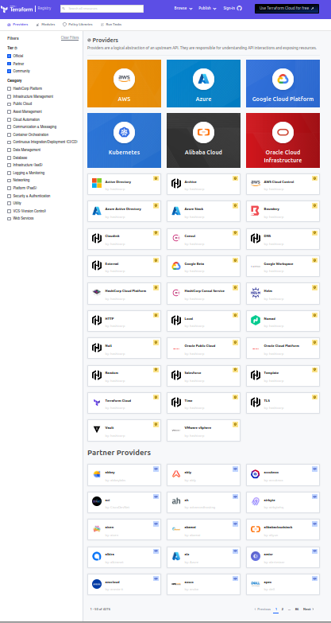

= Rappels Terraform

[%notitle]
== Terraform

[%step]
* Produit Hashicorp
* "Business Source License"
* CLI développée en GoLang
* `init` / `plan` / `apply` [fragment fade-in]#/ repeat# [fragment fade-in]#/ `destroy`#
* HCL

[%notitle]
== How

[.stretch]
image::images/terraform-how.avif[]

== Providers

https://registry.terraform.io/browse/providers

== Resources

Etat souhaité 

[source, java]
----
resource "random_string" "random" { <1>
  length  = 10                      <2>
  special = false
  lower   = true
  numeric = false
  upper   = true
}
----
[%step]
<1> type & nom de la resource
<2> attributs de configuration

== Data Sources

Resources déjà existante
[source, java]
----
data "aws_s3_bucket" "selected" { <1>
  bucket = "bucket.test.com"      <2>
}
----
[%step]
<1> type & nom de la resource
<2> attributs de configuration

== References

[.fragment, json, highlight="2|5", step=2]
----
// lier les resources
  value = random_string.random.result

// utiliser une donnée existante
  value = data.aws_s3_bucket.selected.id
----

== States

[%step]
* Etat connu
* `terraform.tfstate` (fichier JSON)

== Local / remote

[%step]
* Local par défaut
* Remote state (backends)
[%step]
** https://developer.hashicorp.com/terraform/language/settings/backends/local[local]
** https://developer.hashicorp.com/terraform/language/settings/backends/remote[remote]
** Bucket S3 AWS / Google Cloud Storage / Azure BLob Storage / Tencent Cloud Object Storage / Alibaba Cloud OSS
** Consule / Kubernetes secret / Postgres

== Gestion des resources

[%step]
* `apply`
* `import`
* `move`
* `destroy`

== Démo

* Présentation du projet de test
* teste des commandes 
** `fmt`
** `validate`
** `init`
** `plan`
** `apply`