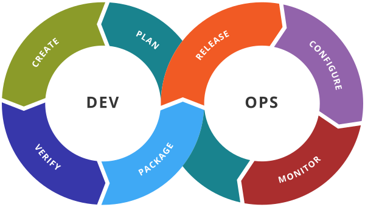

# Migration de projets Terraform vers Terragrunt.
BreizhCamp - Juin 2024
Jérôme Marchand
//:title-logo-image: image:images/logo2x-beta_1479154817.png[]
:toc:
:toc-title: Sommaire
:revealjs_theme: simple
:revealjs_customtheme: my.css
:revealjs_hash: true
:revealjs_width: 1300
:docinfo: shared
:source-highlighter: highlight.js
:highlightjs-theme: node_modules/highlight.js/styles/a11y-light.css 
:icons: font

== Présentation

[%step]
* Jérôme Marchand
* Consultant et Formateur chez Zenika
** Keycloak
** IaC
** DevOps

== Context

REX du cycle de vie d'un ensemble de projets Terraform.

[%step]
[.stretch]

[.notes]
--
Terraform est l'outil des techniciens de l'Empire pour déployer et installer les infrastructures des centres de données au sol et dans les nuages. 
Il fait parfaitement ce que l'on peut attendre de lui, mais a tout de même quelques limites imposées par une autorité et demande parfois du clonage. 
La nouvelle République, propose l'outil Terragrunt. 
Ce wrapper, pour Terraform, fournit des outils pour garder les configurations DRY, travailler avec plusieurs modules et gérer les états distants. 
Après une comparaison avec les Workspaces de Terraform, nous verrons par l'exemple :

* comment cet outil peut répondre à vos cas d'usage
* comment migrer un projet existant
* comment faire vivre le projet Peut être qu'a la suite de cette université, vous voudrez embarquer dans un des vaisseaux qui part construire croiseur galactique.

--

include::00_rappels.adoc[leveloffset=1]

include::01_multi-projets.adoc[leveloffset=1]

include::02_workspaces.adoc[leveloffset=1]

include::25_tooling.adoc[leveloffset=1]

include::03_terragrunt.adoc[leveloffset=1]

include::04_migration.adoc[leveloffset=1]

include::06_conclusion.adoc[leveloffset=1]

